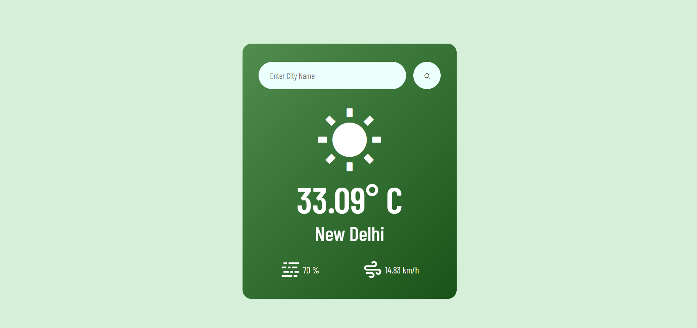

# Weather App

This project is a simple weather application that fetches current weather data for a given city using the OpenWeatherMap API.

## Features

- Display current temperature, city name, humidity, and wind speed.
- Show weather condition icon based on the current weather.
- Responsive design suitable for various screen sizes.

## Demo



## Installation

1. Clone the repository:

   ```bash
   git clone https://github.com/adityadhiman-in/live_weather_app.git
   Navigate into the project directory:
   ```

bash
Copy code
cd live_weather_app
Open index.html in your web browser.

## Usage

Enter a city name in the search input field and press Enter or click the search button. The weather information for the specified city will be displayed.

## Technologies Used

- HTML, CSS
- JavaScript
- OpenWeatherMap API

## Credits

- Author: Aditya Dhiman
- Email: info@adityadhiman.in
- GitHub: adityadhiman-in

## License

This project is licensed under the MIT License - see the LICENSE(LICENSE) file for details.
